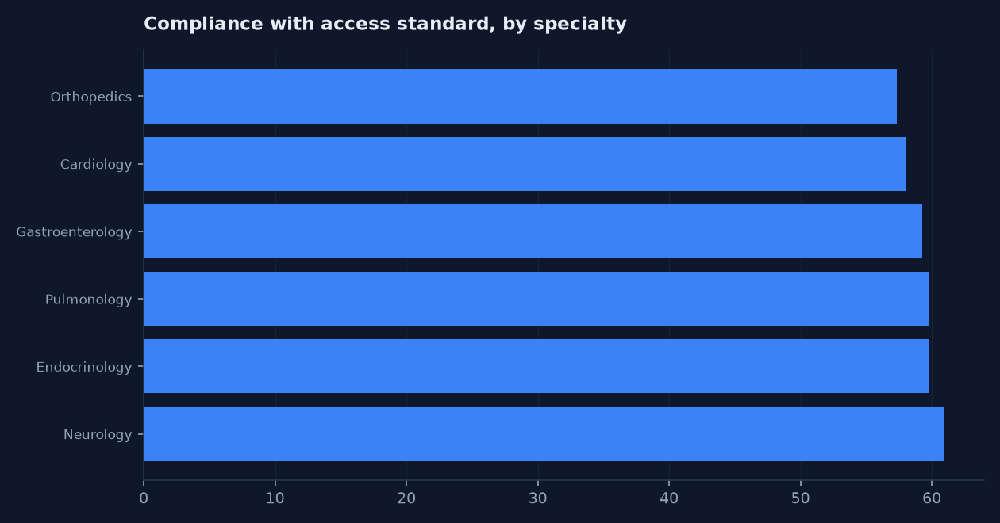
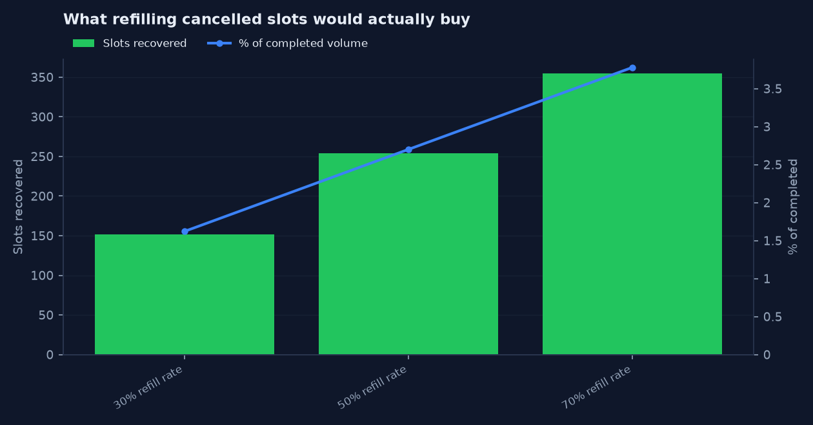
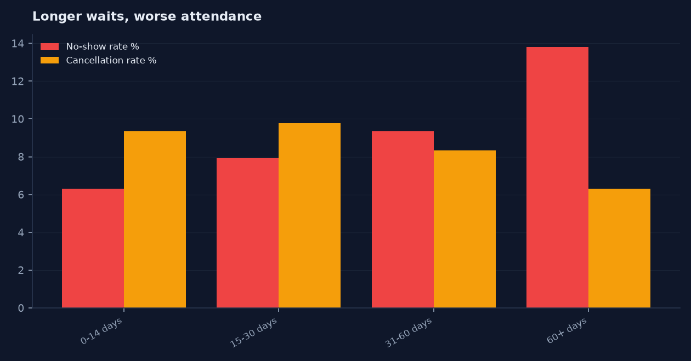

# Capacity-to-Deadline Optimizer

Patients wait 30 days on average for a specialty appointment while 507 cancelled slots go
unfilled. This project quantifies the access gap at Frontier Specialty Care Network, then
builds a scored waitlist queue that tells a scheduler which patient to call when a slot opens.

**Live dashboard: [https://careersahrafanousi-debug.github.io/capacity-to-deadline-optimizer/dashboard/](https://careersahrafanousi-debug.github.io/capacity-to-deadline-optimizer/dashboard/)**

Built by [`src/build_dashboard.py`](src/build_dashboard.py) from the query set in
[`dashboard/dashboard_config.json`](dashboard/dashboard_config.json), run against `data/scheduling.db`.
Every number on the page comes out of a SQL query held in that config file, so the page
cannot drift away from the analysis in [`sql/`](sql/) — regenerate it with
`python src/load_sqlite.py && python src/build_dashboard.py`. Chosen over a `.pbix`
because a reviewer can open a URL and cannot open a binary.

## Built in four tools, from one set of queries

The 17 SQL queries in [`dashboard/dashboard_config.json`](dashboard/dashboard_config.json)
are the single definition of every number in this repository.
[`src/build_bi_assets.py`](src/build_bi_assets.py) runs them once and emits every
artifact below, so none of them can disagree with each other or with
[`sql/`](sql/). Change a query, rerun, and all four change together.

| Folder | What is in it | Open it with |
|---|---|---|
| [`dashboard/`](dashboard/) | Interactive HTML dashboard, [live here](https://careersahrafanousi-debug.github.io/capacity-to-deadline-optimizer/dashboard/) | Any browser, nothing to install |
| [`excel/`](excel/) | `capacity-to-deadline-optimizer_dashboard.xlsx` — native Excel charts over `q_*` query sheets | Excel, LibreOffice, Sheets |
| [`tableau/`](tableau/) | `capacity-to-deadline-optimizer.twb` — Tableau workbook as reviewable XML | Tableau Desktop or Public |
| [`powerbi/`](powerbi/) | Semantic model in TMDL (20 files) and TMSL, plus 26 DAX measures | Power BI Desktop, Tabular Editor |
| [`charts/`](charts/) | Static PNG renders of the headline findings | Nothing — they are below |
| [`bi_extracts/`](bi_extracts/) | 17 tidy CSV outputs, the shared source for Tableau and Power BI | Anything |

Rebuild everything:

```
python src/generate_data.py
python src/load_sqlite.py
python src/build_dashboard.py
python src/build_bi_assets.py
```

No `.pbix`, `.twbx`, or other binary workbook is committed anywhere. They cannot
be diffed, reviewed in a pull request, or opened without a licence, and they
carry a second copy of the data that drifts away from `data/`. The text formats
above give the same result and stay reviewable. Each folder's `README.md`
explains its own trade-offs, including what has and has not been round-tripped
through the vendor tool.

### Headline charts








Fictional organization: **Frontier Specialty Care Network**. All data synthetic.

---

## The business problem

Access is measured by how long a patient waits, but the constraint is rarely raw capacity —
it is how capacity leaks. In this dataset:

- Average lead time is **29.8 days**, and only **59.1%** of appointments meet their
  specialty's own access standard.
- **New patients wait 44.2 days on average** against 23.1 for established patients, and only
  31.4% of new-patient appointments meet the standard.
- **8.98% of appointments are cancelled** and **8.15% are no-shows**. That is roughly one in
  six booked slots not producing a visit.
- 507 of those cancellations arrive with three or more days notice, which is enough time to
  refill them. Nobody does, because there is no ranked list of who to call.

Meanwhile **1,786 patients sit on a waitlist** and over half of them are already past the date
they asked to be seen by.

## Stakeholders

| Stakeholder | What they need |
|---|---|
| Patient access manager | Lead time by specialty against the standard |
| Scheduling supervisors | A ranked call list when a slot opens |
| Specialty clinic leads | Where their own access is worst and why |
| Provider relations | Utilization spread between peers in the same specialty |
| Operations leadership | Whether the problem is capacity or leakage |
| Business analyst | Metric definitions, quality rules, and a defensible score |

## Scope and assumptions

In scope: 13,951 appointments and 1,786 waitlist entries across six specialties and 22
providers, requested between 2026-01-05 and 2026-06-26.

Out of scope: staffing models, referral source analysis, clinical appropriateness of visit
type, payer mix, and anything requiring patient-level identity.

Assumptions:
- A cancellation with **three or more days notice is refillable**. Under three days, the
  realistic fill rate is too low to plan around. This threshold is a judgement call, stated
  openly, and easy to change in one place in the code.
- Each specialty has its own access standard (14, 21, or 30 days) rather than one network-wide
  target, because a 14-day orthopedics standard and a 14-day neurology standard are not
  comparable commitments.
- Waitlist scoring weights are analyst judgement, not a fitted model. See the limitations.

## Data source statement

Fully synthetic, seed 5150. No employer data, no patient data, no PHI. Patients are
represented only as `Group A` through `Group D`. See [`docs/PRIVACY.md`](docs/PRIVACY.md).

## Data model

| Table | Grain | Rows |
|---|---|---|
| `appointments` | One requested or scheduled visit | 13,951 after cleaning |
| `waitlist` | One patient waiting for an earlier slot | 1,786 after cleaning |
| `provider_capacity` | One provider per day | 4,347 |
| `dim_provider` | Provider | 22 |
| `dim_specialty` | Specialty and its access standard | 6 |
| `dim_date` | Calendar day | 173 |

Full field definitions: [`docs/03_data_dictionary.md`](docs/03_data_dictionary.md).

## Data quality approach

Fifteen rules in `src/clean_and_score.py`, documented in
[`docs/07_data_quality_rules.md`](docs/07_data_quality_rules.md). Critical failures are
excluded from reporting and logged; nothing is silently corrected.

Last run: **14,048 rows in, 13,951 out, 376 exceptions, 63 records excluded,
Data Quality Score 99.55%**.

| Rule | Exceptions | Action |
|---|---|---|
| DQ-09 non-standard reminder flag (`Y`, `yes`, `N`) | 138 | Normalized |
| DQ-06 cancelled with no cancellation date | 60 | Retained, excluded from fill analysis |
| DQ-01 duplicate appointment ID | 48 | First occurrence retained |
| DQ-04 appointment datetime missing | 31 | Excluded |
| DQ-14 waitlist requested-by date before date added | 25 | Nulled, urgency scored as unknown |
| DQ-07 cancellation date outside the valid window | 22 | Date nulled, record retained |
| DQ-15 offer accepted with no offer recorded | 20 | Reset to Unknown |
| DQ-03 unrecognized status value | 18 | Excluded |
| DQ-13 waitlist specialty missing | 14 | Excluded |

## Metric definitions

```
Lead Time             = Appointment Date - Request Date            (calendar days)
No-Show Rate          = No Shows / (Completed + No Shows) x 100
Cancellation Rate     = Cancellations / All Appointments x 100
Refillable            = Cancelled AND cancellation notice >= 3 days
Booked Utilization    = Booked Slots / Available Slots x 100
Realized Utilization  = Completed Slots / Available Slots x 100
Leakage               = (Cancelled + No Show Slots) / Booked Slots x 100
```

Booked and realized utilization are reported separately on purpose. A provider can look fully
booked and still deliver far fewer visits, and that gap is the entire point of this project.

### Waitlist Match Score

```
Waitlist Match Score = 35 (Specialty supply match)
                     + 25 (Lead-time urgency)
                     + 20 (Time preference match)
                     + 10 (Notification opt-in)
                     + 10 (Reschedule readiness)
```

Bands: Low 0-49, Moderate 50-64, High 65-79, Critical 80-100.

The specialty component is **not** a flat "same specialty" check. A flat award would give every
row the same 35 points and rank nothing. It instead scales by refillable slots per waiting
patient in that specialty — 35 points at 0.35 or better, down to 8 where supply is thinnest.
Notification opt-in is included because you cannot fill a slot with a patient you cannot reach
in time.

## Findings

**1. Reminders more than halve the no-show rate, and the effect holds inside every visit type.**

| Reminder sent | Attended or missed | No-show rate |
|---|---|---|
| Yes | 7,403 | **5.27%** |
| No | 2,831 | **15.68%** |

Broken out, so this is not just a difference in who receives reminders: established 4.44% vs
13.2%, follow-up 5.02% vs 13.49%, new patient 7.11% vs 22.96%. The gap is consistent and
largest exactly where it costs most.

**2. Long waits erode show rates.**

| Lead time | Appointments | No-show rate |
|---|---|---|
| 0-14 days | 2,817 | 6.32% |
| 15-30 days | 4,225 | 7.93% |
| 31-60 days | 2,677 | 9.34% |
| 60+ days | 515 | **13.79%** |

Access and reliability are the same problem. Making patients wait longer makes them less
likely to arrive, which wastes the slot and lengthens the queue again.

**3. New patients bear almost all of the access failure.** 44.2 days average lead time, 31.4%
within standard, and the highest no-show rate of any visit type. Any access initiative that
reports a blended figure will hide this entirely.

**4. Access is roughly uniform across specialties once each is judged against its own
standard** — 57.4% to 60.9% within standard. That is a useful negative finding: the problem is
network-wide process, not one underperforming clinic. Orthopedics looks worst (57.4%) but only
because it carries the tightest standard at 14 days.

**5. Only 40% of cancellations arrive with enough notice to refill; 53% arrive too late.**

| Notice | Cancellations | Share |
|---|---|---|
| Same day | 293 | 23.4% |
| 1-2 days | 371 | 29.6% |
| 3-7 days | 393 | 31.4% |
| Over 7 days | 114 | 9.1% |
| No date recorded | 82 | 6.5% |

507 refillable slots exist in the period. The 82 with no cancellation date are a data problem
that directly destroys a fill opportunity.

**6. Provider utilization varies widely inside the same specialty.** Realized utilization
ranges from 50.6% to 71.2% among the four pulmonologists — a 20.6 point spread — and 57.4% to
75.4% in orthopedics. Booked utilization hides this: PRV-019 is booked at 72% but realizes only
50.6%, while PRV-021 is booked to 100% and realizes 71.2%.

**7. Over half the waitlist is already late.** 946 of 1,786 waiting patients (53.0%) are past
their requested-by date, worst in endocrinology at 58.0%, with an average 44.1 days waiting.

**8. Notification opt-in does not predict offer acceptance.** Opt-in patients accept 54.0% of
offers, non-opt-in 55.9%. That is a genuine null result, and it matters: opt-in carries 10
points in the Match Score on the reasoning that it speeds contact, not that it predicts a yes.
The score and the evidence should be re-examined together before anyone treats opt-in as an
intent signal.

## Modeled fill opportunity

| Modeled fill rate | Refillable slots | Slots recovered | As % of completed visits |
|---|---|---|---|
| 30% | 507 | 152 | 1.62% |
| 50% | 507 | 254 | 2.70% |
| 70% | 507 | 355 | 3.78% |

Expressed in slots and share of completed visits, never in dollars. No revenue or savings
figure is claimed — any such number would be invented. These are modeled opportunities subject
to validation with scheduling staff.

## Recommendations

1. **Send a reminder on every appointment.** 2,831 appointments in this period had none, and
   they no-showed at three times the rate. This is the largest, cheapest movement available.
2. **Stand up the waitlist action queue.** 316 Critical and 704 High-priority patients are
   scored and ranked; the queue turns 507 refillable cancellations into offers.
3. **Make the cancellation date mandatory at entry.** 82 cancellations cannot be assessed for
   refill because the date is missing. That is a form field, not an analytics project.
4. **Report new-patient access separately** and hold it to its own target. The blended figure
   conceals a 21-day gap.
5. **Prioritize short-lead-time booking for patients already past their requested-by date** —
   53.0% of the waitlist, and the group most likely to disengage.
6. **Review the utilization spread with provider relations,** using realized rather than booked
   utilization. A 20-point spread inside one specialty is a capacity question worth asking
   before adding sessions.
7. **Do not treat notification opt-in as an intent signal** until the null acceptance result is
   explained.

## Future-state workflow

See [`docs/09_to_be_process_map.md`](docs/09_to_be_process_map.md): cancellation logged with a
mandatory date → refillability assessed automatically → waitlist scored and ranked → scheduler
works the queue top down → offer outcome captured → score weights reviewed against realized
acceptance.

## Limitations

- Synthetic data. The patterns are ones I built in, so the analysis demonstrates method, not a
  real finding about real clinics.
- **Score weights are unfitted.** The 35/25/20/10/10 split is analyst judgement. With real
  offer-outcome history, these should be replaced by a fitted model — and finding 8 is exactly
  the kind of evidence that would force a revision.
- The three-day refillability threshold is an assumption, not a measured fill rate.
- Correlation only. The reminder and lead-time relationships in this dataset were generated,
  not observed, and even in real data they would not establish causation.
- The fill simulation assumes recovered slots produce completed visits at the same rate as
  ordinary bookings, which is optimistic.
- No `.pbix` committed. The dashboard is built instead as a live HTML page at
  [https://careersahrafanousi-debug.github.io/capacity-to-deadline-optimizer/dashboard/](https://careersahrafanousi-debug.github.io/capacity-to-deadline-optimizer/dashboard/) by `src/build_dashboard.py`; the Power BI model and
  measure design remain specified in [`docs/10_dashboard_spec.md`](docs/10_dashboard_spec.md).

## How to run it

```bash
pip install -r requirements.txt
python src/generate_data.py      # appointments, waitlist, provider capacity
python src/clean_and_score.py    # cleaning, 15 DQ rules, metrics, waitlist scoring
python src/load_sqlite.py        # data/scheduling.db
sqlite3 data/scheduling.db < sql/06_sql_analysis.sql
```

## Privacy statement

This project uses fully synthetic data created for educational and portfolio purposes. It does
not use employer data, patient information, protected health information, or confidential
business information.
