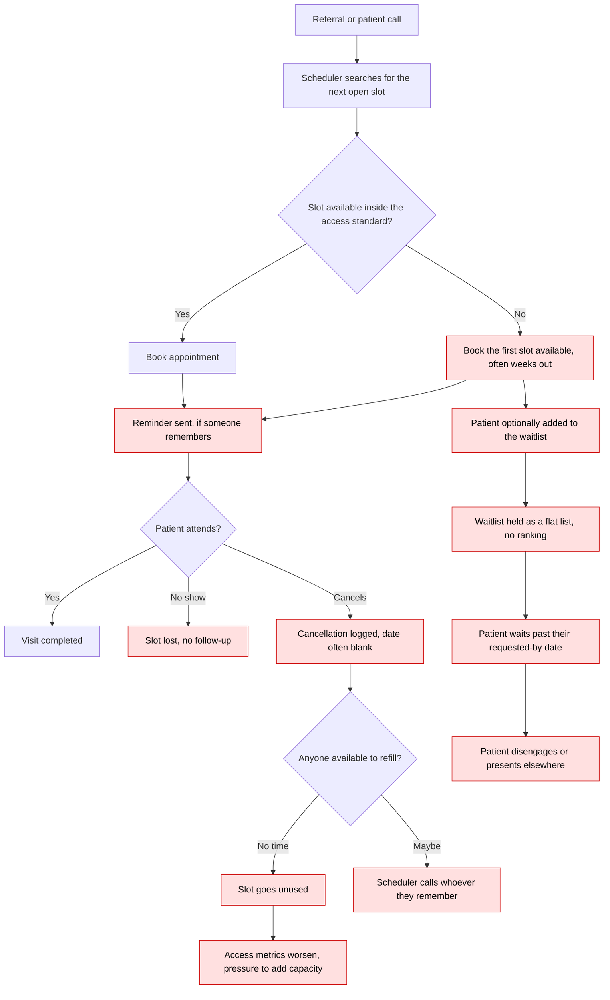

# As-Is Scheduling Process — Frontier Specialty Care Network

## Where it breaks

| # | Breakdown | Evidence in the data |
|---|---|---|
| 1 | Long waits accepted as normal | Average lead time 29.8 days; only 59.1% within standard |
| 2 | New patients absorb the failure | 44.2 days average, 31.4% within standard |
| 3 | Reminders sent inconsistently | 2,831 attended-or-missed appointments had no reminder |
| 4 | No-shows not followed up | 834 no-shows; no rebooking or pattern tracking |
| 5 | Cancellation date not captured | 60 cancelled appointments cannot be assessed for refill |
| 6 | Refillable slots not refilled | 507 cancellations arrived with 3+ days notice |
| 7 | Waitlist unranked | 1,786 waiting patients held as a flat list |
| 8 | Waitlist urgency invisible | 946 patients (53.0%) already past their requested-by date |
| 9 | Utilization judged on bookings, not visits | PRV-019 booked 72%, realizes 50.6% |
| 10 | Capacity treated as the only lever | Realized utilization spread of 20.6 points inside pulmonology |

## Consequence

Roughly one in six booked slots produces no visit. The network is under pressure to add
sessions while 507 already-paid-for slots went unfilled in six months, and the longer patients
wait, the less likely they are to arrive — no-show rates climb from 6.32% under two weeks to
13.79% beyond sixty days. The loop reinforces itself.
