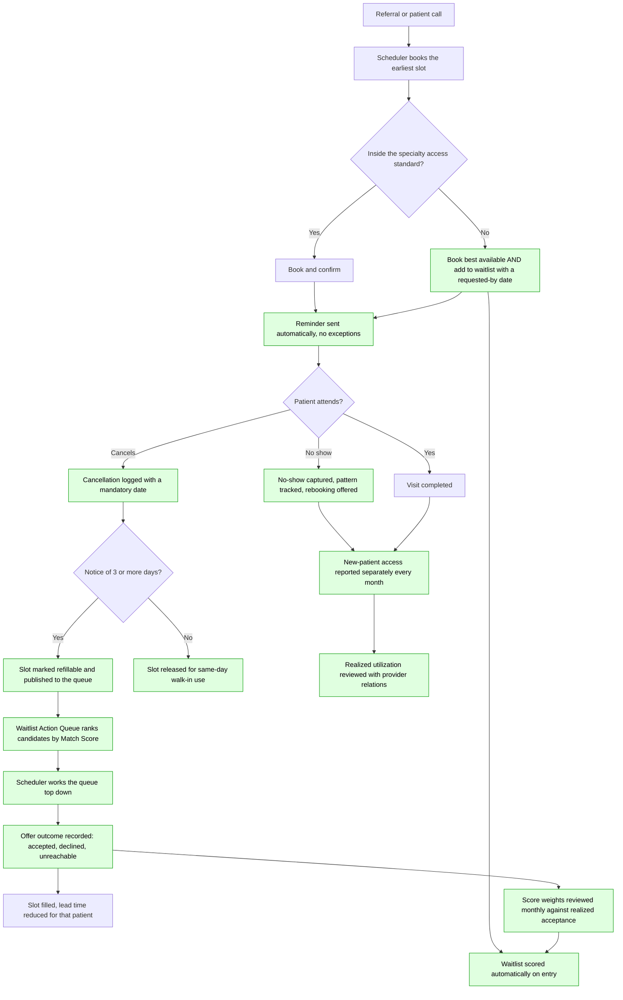

# To-Be Scheduling Process — Capacity-to-Deadline Optimizer

## Controls introduced

| Control | Addresses | How it works |
|---|---|---|
| Mandatory cancellation date at entry | Breakdown 5 | Form validation; recovers 60 currently unassessable records |
| Automatic refillability assessment | Breakdown 6 | 3-day notice threshold applied on logging, no human judgement needed |
| Waitlist Match Score on entry | Breakdowns 7, 8 | Five components, recalculated as supply changes |
| Ranked action queue | Breakdowns 6, 7 | Scheduler works a list instead of recalling names |
| Universal automatic reminders | Breakdown 3 | Removes the 2,831-appointment coverage gap |
| No-show follow-up and pattern tracking | Breakdown 4 | Rebooking offered; repeat patterns surfaced |
| Separate new-patient access reporting | Breakdown 2 | Blended metric never shown alone |
| Realized utilization review | Breakdowns 9, 10 | Provider relations sees visits delivered, not slots booked |
| Monthly weight review against outcomes | — | Closes the loop on the unfitted score; see finding 8 |

## The feedback loop is the point

The single most important arrow in this map is the one from offer outcome back to score
weights. The current weights are analyst judgement, and the data already contradicts one of
them — notification opt-in shows no acceptance advantage (54.0% vs 55.9%). Without captured
offer outcomes there is no way to fix that. With them, the score becomes a model instead of an
opinion.

## What this does not fix

Nothing here creates capacity. If a specialty is structurally short of sessions, a better queue
reallocates the shortage more fairly and more quickly but does not remove it. The utilization
spread in pulmonology and orthopedics suggests there is real headroom to recover first, which
is a cheaper conversation than adding clinics — but that has to be tested with the clinical
teams, not asserted from this data.

## Implementation sequence

1. Make the cancellation date mandatory, and turn on automatic reminders. Both are
   configuration, not analytics, and together they address the two largest findings.
2. Publish the scored waitlist as a read-only queue and let schedulers work it manually.
3. Capture offer outcomes.
4. Add the refillable-slot publication step so the queue is driven by real openings.
5. Begin monthly weight review; replace judgement weights with fitted ones once enough outcome
   history exists.
6. Take realized utilization to provider relations with the spread analysis.
